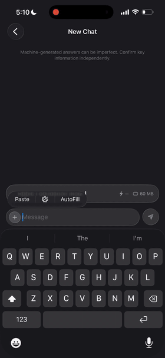

<p align="center">
  
  
  
  
</p>

<h1 align="center">🔥 Forge</h1>

<p align="center">
  <strong>A floating SwiftUI overlay debugger for local LLMs.</strong><br>
  <em>Pin one bar above your chat input. Get live tokens/sec, memory, context, and threshold-colored graphs —<br>
  for any inference stack — with one protocol property.</em>
</p>

<p align="center">
  Plug-and-play • Engine-agnostic • Glass-styled • Animated charts • Device-aware
</p>

<!--
  GitHub only renders <video> tags whose src is on a github-owned CDN that
  user-attachments produces (issue/PR drag-drop), and that URL can't be
  generated via API. Bare release-asset .mp4 URLs render as plain links.
  The animated GIF in the repo, on the other hand, renders inline via the
  standard markdown image syntax — so we ship a GIF for the README preview
  and keep the full-quality MP4 on the `demo-assets` release for download.
-->

<p align="center">
  <a href="https://github.com/haplollc/Forge/releases/download/demo-assets/forge_demo.mp4">
    
  </a>
  <br>
  <sub><em>Tap to expand → live, threshold-colored sparklines for tokens/sec and memory, device-aware Y axes, progressive-blur scroll edge under a floating toolbar. <a href="https://github.com/haplollc/Forge/releases/download/demo-assets/forge_demo.mp4">Watch full-quality MP4 →</a></em></sub>
</p>

---

## Why Forge

Cloud LLMs have Langfuse, Arize, OpenTelemetry. Local Swift LLMs have `print()`. Forge is the floating debugger you've been hand-rolling: drop one view above your chat input, conform your AI manager to one protocol, and a glassy collapsible HUD lights up with live metrics from whatever inference stack you're using — Kuzco, llama.cpp, MLX, Apple Foundation Models, your own.

The collapsed bar matches the footprint of an empty input bar. Tap to expand into a full panel with a floating toolbar and progressive-blur scroll edges, then watch threshold-colored sparklines for tokens-per-second and memory tick along in real time. The Y axes are pinned to **device-aware ceilings** — Forge queries the OS for your process's actual memory budget and uses that to draw the danger zones, so a chart on iPhone 12 reads differently from one on M4 iPad even though the code is identical.

## Highlights

| Feature | Notes |
|---|---|
| 🪄 **One drop-in view** | `ForgeBar(provider:isEnabled:)` — sized to match an empty single-row input bar |
| 🔌 **One-property protocol** | Conform `ForgeProvider`, return a `ForgeSnapshot` |
| 🧪 **Engine-agnostic** | Kuzco, llama.cpp wrappers, MLX, Apple Foundation Models, your own |
| 🍎 **Apple Intelligence-aware** | Works seamlessly when your chat is using `SystemLanguageModel` |
| ✨ **Animated charts** | Catmull-Rom sparklines, threshold-zoned color (green → yellow → orange → red), pulsing tip dot, smooth value transitions |
| 🪟 **Floating toolbar + progressive blur** | Sticky `xmark` / title / status — content scrolls under a soft material gradient instead of a hard divider |
| 📏 **Device-aware Y axes** | Memory ceiling = `phys_footprint + os_proc_available_memory()`. No hard-coded device classes |
| 🔄 **Auto-TPS** | Call `Forge.shared.tick(tokens:)` per chunk — Forge computes a rolling-window rate that decays to zero when streaming stops |
| 🛟 **Accurate memory** | Uses `task_vm_info.phys_footprint` — the same number Xcode's memory gauge and iOS jetsam decisions use |
| 🛠️ **Custom metrics** | Add app-specific tiles with `ForgeMetric(label:value:systemImage:)` |
| 🚦 **Toggle-friendly** | `isEnabled:` parameter wires cleanly to a `@AppStorage` dev-mode flag |

## Installation

### Swift Package Manager

```swift
dependencies: [
    .package(url: "https://github.com/haplollc/Forge.git", from: "0.1.0")
]
```

**Or in Xcode:** File → Add Package Dependencies → `https://github.com/haplollc/Forge.git`

## Quickstart

### 1. Conform your AI manager to `ForgeProvider`

The protocol has exactly one requirement: a `forgeSnapshot` computed property. Return whatever you have — every field on `ForgeSnapshot` is optional, and Forge fills in the rest itself (memory, thermal, auto-computed TPS).

```swift
import Forge

extension MyChatService: ForgeProvider {
    @MainActor
    var forgeSnapshot: ForgeSnapshot {
        ForgeSnapshot(
            modelName: engine.currentModel?.name,
            modelArchitecture: engine.currentModel?.architecture,    // e.g. "llama"
            contextUsed: engine.usedContextTokens,
            contextWindow: engine.contextWindowSize,
            promptTokens: engine.lastPromptTokenCount,
            completionTokens: engine.lastCompletionTokenCount,
            isGenerating: engine.isStreaming,
            statusLabel: engine.isStreaming ? "Streaming" : "Idle",
            temperature: engine.temperature,
            topP: engine.topP,
            topK: engine.topK,
            customMetrics: [
                ForgeMetric(label: "Backend",  value: "Metal",   systemImage: "cpu"),
                ForgeMetric(label: "Quant",    value: "Q4_K_M",  systemImage: "square.stack.3d.up")
            ]
        )
    }
}
```

### 2. Place `ForgeBar` above your chat input

The cleanest pattern is to embed it as a sibling above your input bar. Forge's collapsed state is sized to match an empty single-row input pill (`cornerRadius 22`, `ultraThinMaterial`, `glassEffect` on iOS 26+), so the two read as one consistent stack.

```swift
import Forge

struct ChatView: View {
    @StateObject private var chatService = MyChatService()
    @AppStorage("forgeOverlayEnabled") private var forgeOverlayEnabled = false

    var body: some View {
        VStack { /* …your messages list… */ }
            .safeAreaInset(edge: .bottom) {
                VStack(spacing: 8) {
                    ForgeBar(provider: chatService, isEnabled: forgeOverlayEnabled)
                    ChatInputBar(/* … */)
                }
            }
    }
}
```

Don't have a custom safe-area inset? Use the convenience modifier — it pins a `ForgeBar` to the bottom for you:

```swift
ChatView()
    .forgeOverlay(provider: chatService, isEnabled: forgeOverlayEnabled)
```

Tap the bar to expand. Tap the floating glass `xmark` (top-left) to collapse.

### 3. (Optional) Let Forge compute tokens/sec for you

If your engine doesn't expose a live `tokensPerSecond`, hand Forge per-chunk events and it'll compute a rolling 1.5-second rate. For engines that emit one token per chunk (most llama.cpp wrappers), pass `tokens: 1`. For engines that emit multi-token chunks (Apple Foundation Models snapshot deltas), use `Forge.estimateTokens(in:)` — a character-based BPE-style heuristic.

```swift
Forge.shared.beginGeneration()
for try await chunk in engine.stream(prompt: prompt) {
    Forge.shared.tick(tokens: Forge.estimateTokens(in: chunk))
    // …append chunk to your message…
}
Forge.shared.endGeneration()
```

`Forge.shared.firstTokenLatencyMs` is also captured automatically, and the displayed rate decays to zero ~1.5s after streaming stops so it doesn't freeze on stale numbers.

## Working with multiple engines

Forge is a single `ForgeProvider` per UI surface. If your app supports more than one inference backend (e.g. local GGUF *and* Apple Foundation Models), build a small adapter that forwards to the right one based on which is active. Pattern:

```swift
@MainActor
final class MyForgeAdapter: ObservableObject, ForgeProvider {
    @Published var activeBackend: Backend = .local
    @Published var isAppleStreaming: Bool = false
    weak var localEngine: MyLocalEngine?

    var forgeSnapshot: ForgeSnapshot {
        switch activeBackend {
        case .local:
            return localEngine?.forgeSnapshot ?? .empty
        case .apple:
            return ForgeSnapshot(
                modelName: "Apple Foundation Model",
                modelArchitecture: "FOUNDATION",
                isGenerating: isAppleStreaming,
                statusLabel: isAppleStreaming ? "Streaming" : "Ready",
                customMetrics: [
                    ForgeMetric(label: "Backend",
                                value: "Apple Intelligence",
                                systemImage: "apple.logo")
                ]
            )
        }
    }
}
```

Around your Apple FM streaming loop, toggle `adapter.isAppleStreaming = true/false` and call the same `Forge.shared.beginGeneration()` / `tick(tokens:)` / `endGeneration()` you'd use with any other engine. Forge picks up the snapshot change and re-skins the panel automatically.

## Inside the HUD

### Collapsed (bar)

```
┌──────────────────────────────────────────────────────────────┐
│  ●  Llama-3.2-3B-Instruct.Q4_K_M     ⚡ 24.3 t/s    💾 1.2 GB │
└──────────────────────────────────────────────────────────────┘
```

Status dot (pulses when generating) · model name (truncated middle) · live TPS · live `phys_footprint` memory.

### Expanded (panel)

```
┌──────────────────────────────────────────────────────────────┐
│  [✕]            Forge                                  ●     │  ← floating toolbar over progressive blur
│ ─ ─ ─ ─ ─ ─ ─ ─ ─ ─ ─ ─ ─ ─ ─ ─ ─ ─ ─ ─ ─ ─ ─ ─ ─ ─ ─ ─ ─ ─  │
│  Llama-3.2-3B-Instruct.Q4_K_M  LLAMA  Streaming               │
│                                                                │
│  TOKENS / SEC                                          27.6   │
│  ▁▂▃▆█▇▆▅▄▃▄▆█▇▆██▇▆▅▄▅▆▇████▇▇▆▇▇▇█▇▆█▇▇▆▆▇█▇▇▆▆▇▇█▆▇▇█      │
│                                                                │
│  MEMORY                                                1.2 GB │
│  ▁▁▂▂▃▃▃▃▃▄▄▅▅▅▆▆▆▆▆▆▇▇▇▇▇████████████████████████████        │
│                                                                │
│  CONTEXT  ▓▓▓▓▓▓▓▓▓░░░░░░░░░░░░  4128 / 8192                  │
│                                                                │
│  ┌──────────┐  ┌──────────┐                                   │
│  │ FIRST    │  │ TOKENS   │                                   │
│  │ 87 ms    │  │ 421 → 178│                                   │
│  └──────────┘  └──────────┘                                   │
│                                                                │
│  ┌──────────┐  ┌──────────┐                                   │
│  │ THERMAL  │  │ REFRESH  │                                   │
│  │ Nominal  │  │ 4 Hz     │                                   │
│  └──────────┘  └──────────┘                                   │
│                                                                │
│  temp 0.70   top-p 0.95   top-k 40                            │
└──────────────────────────────────────────────────────────────┘
```

- **Floating toolbar** — sits above a `.ultraThinMaterial` overlay masked with a 4-stop alpha gradient. Content scrolls under the toolbar and progressively blurs as it approaches the top edge instead of hitting a hard divider.
- **`xmark` glass circle** — animates in from scale + opacity when expanding.
- **Edge-to-edge scroll** — `contentMargins` keep the first item visible at rest while letting older items dissolve into the blur as you scroll.
- **Threshold-colored value labels** — the live TPS / memory readouts and tip dots adopt the current zone color.

## Live charts

Each chart is hand-tuned. Recipe per chart:

- **Catmull-Rom interpolation** for smooth curves
- **Vertical threshold gradient** for stroke color (green → yellow → orange → red, direction is per-metric)
- **Vertical threshold gradient (softer alpha)** for the area fill under the curve
- **Pulsing tip dot** at the latest sample (grows when generating)
- **Faint dashed reference line** at the danger threshold
- **Fixed Y axis** — `0…domain.upperBound`, set by `ForgeChartStyle` (no auto-rescaling, so a stable value reads as a flat line)
- **Fixed X axis** — `0…(capacity − 1)`. The line starts on the left and fills to the right; once the buffer is full, oldest samples drop off the left in a smooth left-scroll
- **Smooth value-change animation** — `.easeInOut(duration: 0.45)` on each new sample

`ForgeFillBar` (the context-window readout) animates progress with the same `easeInOut(duration: 0.45)` and tints both the bar and the value label with the current threshold color.

## Threshold colors & device awareness

Forge ships sensible defaults, all tuned at runtime — **no hard-coded device classes**.

### Memory

- Domain `0…budget` where `budget = phys_footprint + os_proc_available_memory()`. That's the OS's live ceiling for *this* process — works the same way iOS makes jetsam decisions.
- Re-probed each tick, so a budget that shrinks under memory pressure reflects in the chart immediately.
- Direction `lowerIsBetter`. Default thresholds: **green** ≤ 55% of budget, **yellow** 55-75%, **orange** 75-88%, **red** > 88%.

### Tokens / sec

- Domain `0…max(30, observedPeak × 1.2)` — stable while values are below 30, expands when a model genuinely runs faster.
- Direction `higherIsBetter`. Default thresholds during generation: **green** ≥ 55% of cap, **yellow** ≥ 30%, **orange** ≥ 15%, **red** < 15%.

### Context

- Domain `0…1` (fraction of window).
- Direction `lowerIsBetter`. Default thresholds: **green** ≤ 55%, **yellow** 55-75%, **orange** 75-90%, **red** > 90%.

If you want to override, instantiate a `ForgeChartStyle` directly and pass it to `ForgeChart` from your own embedding.

## API surface

### `ForgeProvider`

```swift
public protocol ForgeProvider: AnyObject {
    @MainActor var forgeSnapshot: ForgeSnapshot { get }
}
```

### `ForgeSnapshot`

Free-form. Every field is optional except `isGenerating`. Construct it however your engine exposes data.

```swift
public struct ForgeSnapshot {
    public var modelName: String?
    public var modelArchitecture: String?
    public var contextUsed: Int?
    public var contextWindow: Int?
    public var promptTokens: Int?
    public var completionTokens: Int?
    public var firstTokenLatencyMs: Double?
    public var tokensPerSecond: Double?
    public var isGenerating: Bool
    public var statusLabel: String?
    public var temperature: Double?
    public var topP: Double?
    public var topK: Int?
    public var seed: Int?
    public var customMetrics: [ForgeMetric]
}
```

### `ForgeMetric`

```swift
ForgeMetric(label: "Backend", value: "Metal", systemImage: "cpu")
```

### `Forge.shared`

```swift
@MainActor public final class Forge: ObservableObject {
    public static let shared: Forge

    public func beginGeneration()
    public func tick(tokens: Int = 1)
    public func endGeneration()
    public func reset()

    public static func estimateTokens(in text: String) -> Int

    public var firstTokenLatencyMs: Double?
    public var autoTokensPerSecond: Double
    public var generatedTokens: Int
}
```

### `ForgeBar` (recommended)

```swift
public struct ForgeBar: View {
    public init(provider: ForgeProvider?, isEnabled: Bool = true, refreshHz: Double = 4)
}
```

Embed directly as a sibling above your chat input bar.

### `.forgeOverlay(...)` (convenience)

```swift
extension View {
    func forgeOverlay(
        provider: ForgeProvider?,
        isEnabled: Bool = true,
        refreshHz: Double = 4
    ) -> some View
}
```

Pins a `ForgeBar` to the bottom safe-area inset. Use it when you don't already have a custom bottom inset and just want a one-liner.

`refreshHz` controls how often Forge polls your `forgeSnapshot`. The default of 4 Hz is plenty for a debugger and trivially cheap.

### `ForgeChartStyle` (optional)

```swift
public struct ForgeChartStyle: Sendable {
    public enum Direction { case higherIsBetter, lowerIsBetter }

    public var domain: ClosedRange<Double>
    public var direction: Direction
    public var nominalThreshold: Double
    public var warningThreshold: Double
    public var dangerThreshold: Double

    public init(domain:, direction:, nominal:, warning:, danger:)
    public func color(for value: Double) -> Color
    public var verticalGradient: LinearGradient
    public var verticalAreaGradient: LinearGradient

    public static func memory(budgetMB: Double) -> ForgeChartStyle
    public static func tokensPerSecond(observedPeak: Double) -> ForgeChartStyle
    public static var contextUsage: ForgeChartStyle
}
```

## What's included

```
Sources/Forge/
├── Forge.swift                  // Shared event sink (begin / tick / end / estimateTokens)
├── ForgeProvider.swift          // The plug-and-play protocol
├── ForgeSnapshot.swift          // Snapshot + ForgeMetric types
├── ForgeStore.swift             // Observable + rolling history buffers + budget probe
├── ForgeMetricsProbe.swift      // phys_footprint memory + os_proc_available_memory + thermal
├── ForgeChartStyle.swift        // Threshold gradients, per-metric defaults
└── Views/
    ├── ForgeOverlay.swift       // Collapsed bar + expanded panel + progressive-blur toolbar
    ├── ForgeOverlayModifier.swift  // ForgeBar view + .forgeOverlay() modifier
    ├── ForgeChart.swift         // Animated sparklines + context-fill bar
    ├── ForgeMetricTile.swift    // One tile in the expanded grid (monochrome)
    ├── ForgeGlassButton.swift   // The xmark glass button
    └── ForgeBackport.swift      // Glass-style background helper
```

Tests live under `Tests/ForgeTests/`. CI runs on a self-hosted macOS runner; both `swift build` and an iOS Simulator build are exercised.

## Patterns

### Gate it behind a setting

```swift
@AppStorage("forgeOverlayEnabled") private var forgeOverlayEnabled = false

// In Settings:
Toggle("Forge Debugger Overlay", isOn: $forgeOverlayEnabled)

// In your chat view:
ForgeBar(provider: aiManager, isEnabled: forgeOverlayEnabled)
```

### DEBUG-only attachment

```swift
ChatView()
#if DEBUG
    .forgeOverlay(provider: aiManager)
#endif
```

### Tie status text to a generation phase enum

```swift
var forgeSnapshot: ForgeSnapshot {
    let label: String = switch engine.phase {
        case .idle: "Idle"
        case .loadingModel: "Loading model…"
        case .thinking: "Thinking…"
        case .streaming: "Streaming"
    }
    return ForgeSnapshot(
        modelName: engine.modelName,
        isGenerating: engine.phase != .idle,
        statusLabel: label
    )
}
```

### Add app-specific custom metrics

```swift
customMetrics: [
    ForgeMetric(label: "Tools", value: enabledToolNames.joined(separator: ", "), systemImage: "wrench"),
    ForgeMetric(label: "Memory KB", value: kbCount, systemImage: "books.vertical"),
    ForgeMetric(label: "VLM", value: model.isVLM ? "yes" : "no", systemImage: "eye")
]
```

## Roadmap

- 🧱 **Grammar inspector** — visualize GBNF state and which tokens were masked
- 🔬 **Token logit panel** — see top-k logits and the chosen token per step
- 🛠️ **Tool-call trace** — surface model-emitted tool calls and executor responses
- ⏪ **Branch & replay** — fork a generation from any token with different params
- 📤 **Export** — JSON / `.traceforge` bundles for offline inspection

## License

MIT © [Haplo LLC](https://haplo.ai)
